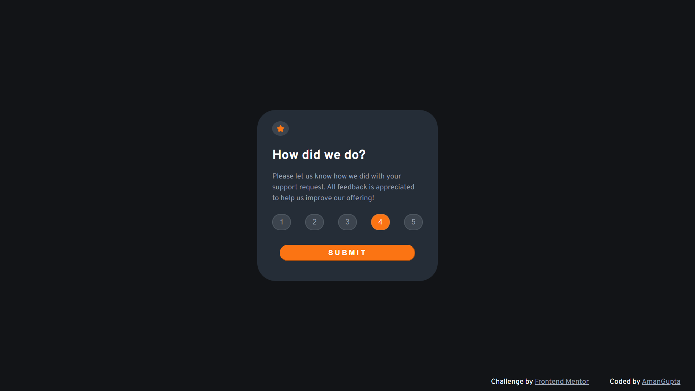
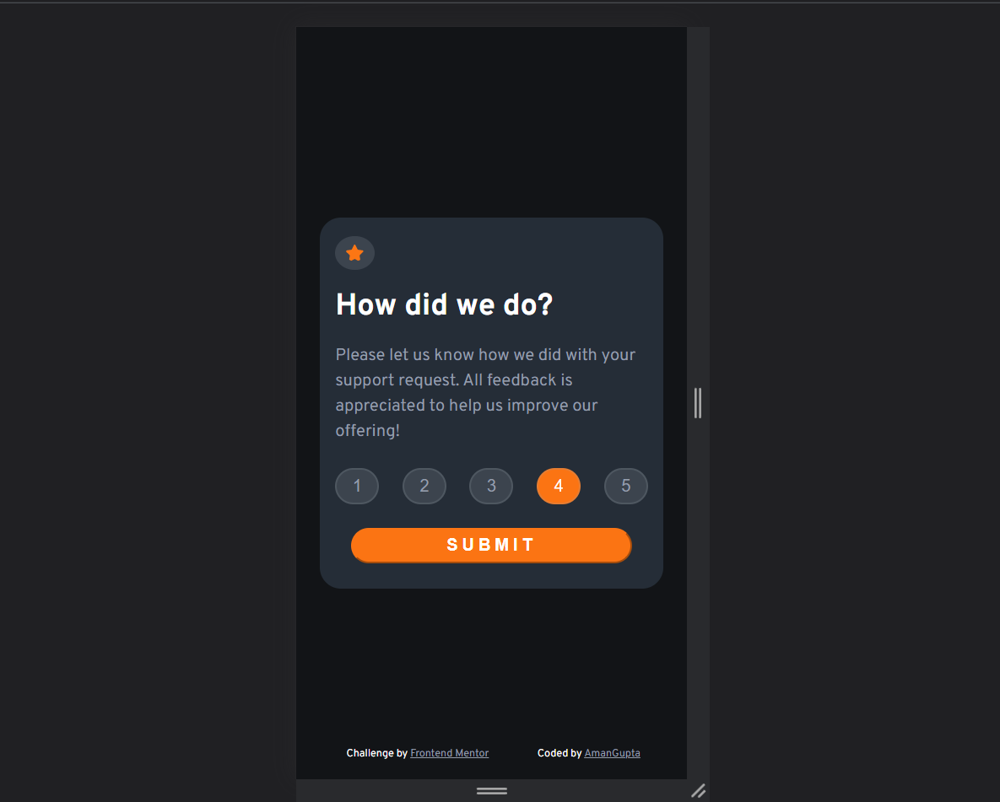
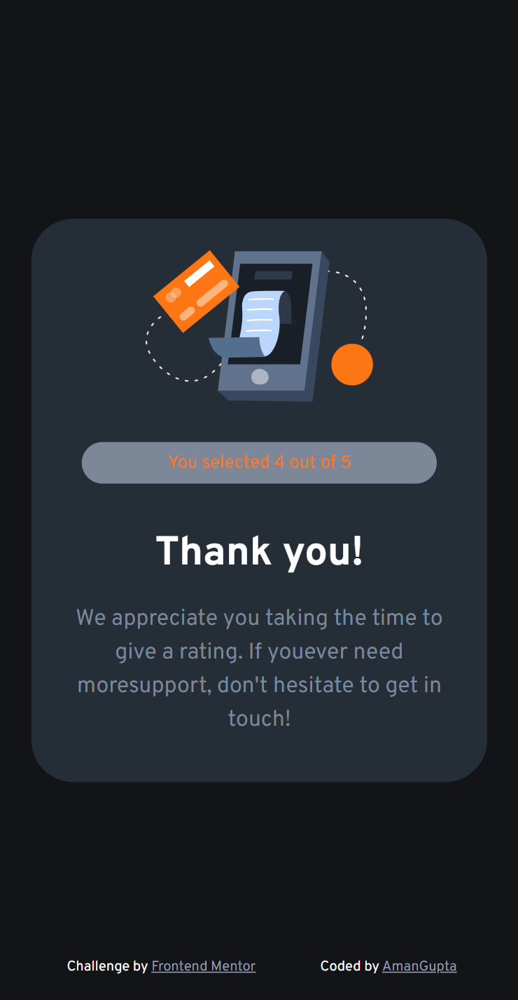
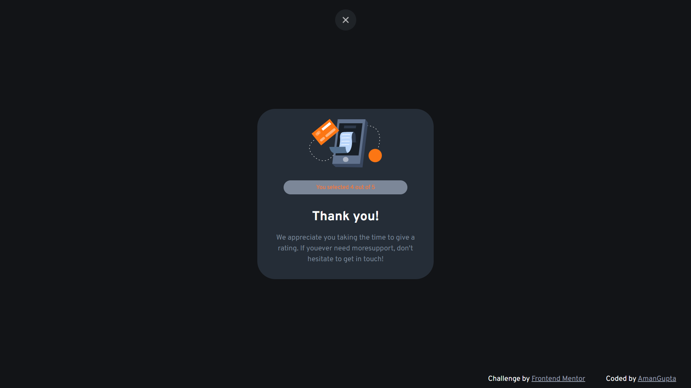

# Frontend Mentor - Interactive rating component solution

This is a solution to the [Interactive rating component challenge on Frontend Mentor](https://www.frontendmentor.io/challenges/interactive-rating-component-koxpeBUmI). Frontend Mentor challenges help you improve your coding skills by building realistic projects. 

## Table of contents
  - [The challenge](#the-challenge)
  - [Screenshot](#screenshot)
  - [Links](#links)
  - [Built with](#built-with)
  - [Continued development](#continued-development)
  - [Useful resources](#useful-resources)
- [Author](#author)

### The challenge

Users should be able to:

- View the optimal layout for the app depending on their device's screen size
- See hover states for all interactive elements on the page
- Select and submit a number rating
- See the "Thank you" card state after submitting a rating

### Screenshot







### Links

- Solution URL: [Rating Component Solution](https://github.com/AmanGupta1703/Rating-Component)
- Live Site URL: [Rating Component](https://amangupta1703.github.io/Rating-Component/)

### Built with
- CSS custom properties
- Flexbox

### What I learned

```html
<div class="container">

    <div class="rating-box">

      <div class="rating-box-banner">

        

      </div>

      <div class="rating-box-text-content">

        <h3 class="rating-heading font-weight-700 ">How did we do?</h3>

        <p class="rating-box-text">Please let us know how we did with your support request. All feedback is appreciated
          to help us improve our offering!</p>

        <div class="rating-btn-group">
          <button class="rating-btn" id="1">1</button>
          <button class="rating-btn" id="2">2</button>
          <button class="rating-btn" id="3">3</button>
          <button class="rating-btn" id="4">4</button>
          <button class="rating-btn" id="5">5</button>
        </div>

        <button class="submit-btn font-weight-700">Submit</button>

      </div>

    </div>

  </div>
```
```css
body {
    background-color: hsl(216, 12%, 8%);
    font-family: 'Overpass', sans-serif;
    display: flex;
    align-items: center;
    justify-content: center;
    min-height: 100vh;
}

.container {
    display: flex;
    justify-content: center;
}

/* Rating Component */
.rating-box {
    background-color: var(--dark-blue-color);
    border-radius: 40px;
    width: 40%;
    padding: 3% 4%;
}
```
```js
for (let i = 0; i < ratingBtn.length; i++) {
  ratingBtn[i].addEventListener("click", function (event) {
    ratingBtn[i].classList.toggle("rating-btn-pressed");

    ratingArr.push(event.target.id);
    console.log(ratingArr);

    submitBtn.addEventListener("click", function () {
      if (ratingArr.length === 0) {
        submitBtn.innerHTML = "Please rate!";

        setTimeout(function () {
          submitBtn.innerHTML = submitBtnTextContent;
        }, 2000);
      } else if (ratingArr.length >= 1) {
        ratingContainer.style.display = "none";
        thankYouContainer.style.display = "flex";
        userRating.innerHTML = `You selected ${event.target.id} out of 5`;
      }
    });
  });
}
```

### Continued development

1) JavaScript Events
2) CSS Position

### Useful resources

- [W3School -> JS Events](https://www.w3schools.com/jsref/dom_obj_event.asp) 
- [W3School -> CSS Variables](https://www.w3schools.com/css/css3_variables.asp)

## Author

- Website - [Interactive Rating Component](https://amangupta1703.github.io/Rating-Component/)
- Frontend Mentor - [@AmanGupta1703](https://www.frontendmentor.io/profile/AmanGupta1703)
